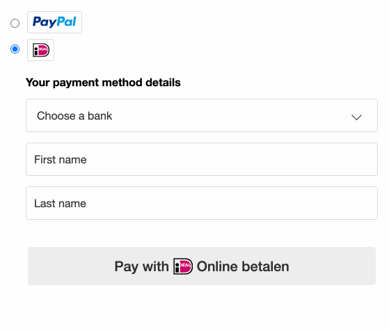
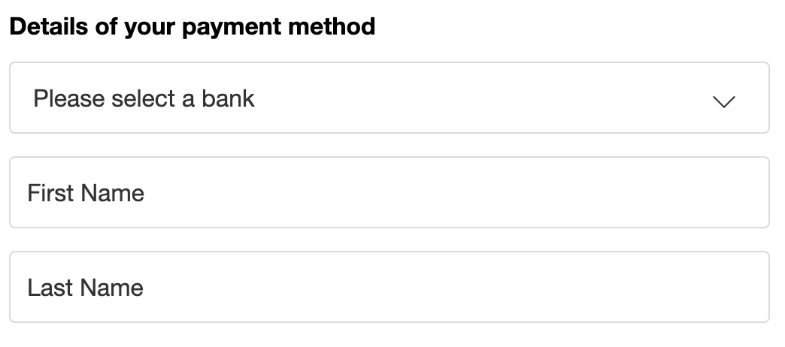

# Paying with iDEAL or PayPal on the web

<p>


</p>

This integration uses the JavaScript SDK to accept iDEAL payments


See a [hosted version](https://paypal-ideal-js-sdk.herokuapp.com/) of the sample

**Features:**
- Accept iDEAL or PayPal payments 🏦 💶
- Localization in over 35 different languages 🌍
- Customizable styles 
- Handling Webhook events  ⚓️

**Demo:** 

<p align="center">
  
</p>

## How to run locally

1. Clone the repo  `git clone git@github.com:paypal-examples/ideal-paypal-payment-js-sdk.git`


2. Copy the .env.example file into a file named .env
```
cp .env.example .env
```

3. Run `npm install`


4. configure your `.env` config file with your Paypal (Sandbox)
`CLIENT_ID` and `CLIENT_SECRET`

these can be obtained [here](https://developer.paypal.com/docs/api-basics/sandbox/credentials/)

5. Update `client/index.html` script src `clientId` param

   `https://www.paypal.com/sdk/js?client-id=<CLIENT_ID>&...`
   
6. `npm start`.

#### Listen to Webhooks

1.  Run `npm run webhook-proxy` take note of the `webhookId`.


2. Update your `.env` file `WEBHOOK_ID` value.


3. Restart the server `npm start`


&nbsp;


**Loading the JavaScript SDK**


The sdk requires the following query params to be configured on the script src to accept ideal payments.

| **Param**   |       **Value**     |
|----------|:-------------:|
| client-id |   PayPal ClientId  |
| components |  buttons,fields,marks,funding-eligibility |
| enable-funding |   ideal   |
| currency | EUR |

Example:

```
<script src="https://www.paypal.com/sdk/js?client-id=<CLIENT_ID>&components=buttons,fields,marks,funding-eligibility&enable-funding=ideal&currency=EUR"></script>
```

##### Order Payload

Please note iDEAL orders are required to be created in `EUR`
```
{
  purchase_units: [
    {
      amount: {
        currency_code: "EUR",
        value: "49.99"
      }
    }
  ],
  application_context: {
    return_url: `${window.location.origin}/success`,
    cancel_url: `${window.location.origin}/cancel`
  }
}
```

#### Components

**Mark**

 
  
```
paypal
  .Marks({
    fundingSource: paypal.FUNDING.IDEAL
  })
  .render("#ideal-mark");
```

**PaymentFields**

Render the fields to capture required customer information.

It gives the option to prefil the customer name field if this is already obtained via `fields.name.value` property.



```
paypal
  .PaymentFields({
    fundingSource: paypal.FUNDING.IDEAL,
    style: {},
    fields: {
      name: {
        value: "",
      },
    },
  })
  .render("#ideal-fields");

```
**Style object:**
```
const style = {
  base: {
    backgroundColor: "white",
    color: "black",
    fontSize: "16px",
    fontFamily: '"Helvetica Neue", Helvetica, sans-serif',
    lineHeight: "1.4",
    letterSpacing: "0.3"
  },
  input: {
    backgroundColor: "white",
    fontSize: "16px",
    color: "#333",
    borderColor: "#dbdbdb",
    borderRadius: "4px",
    borderWidth: "1px",
    padding: "1rem"
  },
  invalid: {
    color: "red"
  },
  active: {
    color: "black"
  }
}
```

**Button**


 

```
paypal
  .Buttons({
    fundingSource: paypal.FUNDING.IDEAL,
    style: {
      label: "pay"
    },
    createOrder(data, actions) {
      /* see order payload info */
      return actions.order.create(order);
    },
    onApprove(data, actions) {
       console.log("order approved")
    },
    onCancel(data, actions) {
      console.log("onCancel called");
    },
    onError(err) {
      console.error(err);
    }
  })
  .render("#ideal-btn");
  ```


&nbsp;

